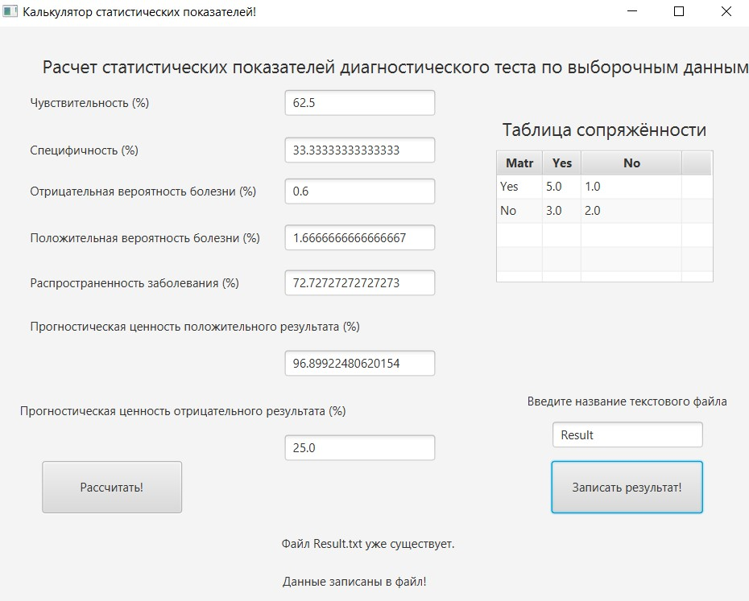

# Calculation-statistical-indicators
# Разработка программы расчета статистических показателей диагностического теста по выборочным данным
## В рамках данного курсового проекта была разработана программа для расчета статистических показателей диагностического теста по выборочным данным. Были изучены основные методы и инструменты анализа данных, необходимые для точного расчета показателей.
В ходе разработки программы были решены следующие задачи:
1.	Были изучены основные конструкции языка программирования Java и основные возможности системы управления базами данных H2.
2.	Проанализированы несколько существующих аналогов программного продукта.
3.	Спроектирован и реализован собственный программный продукт с применением указанных технологий.
4.	Проведено тестирование.
# Интерфейс программы
Главное окно программы

Также для приложения были сгенерированы javadocs, с которыми можно ознакомится в [папке](https://github.com/Elizaveta-Strukova/Calculation-statistical-indicators/tree/main/JavaDocs). 
## Средства разработки
Для создания GUI был использован JavaFx. В качестве базы данных была использована PostgreSQL.
